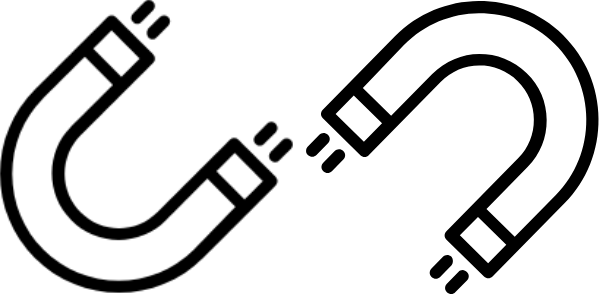
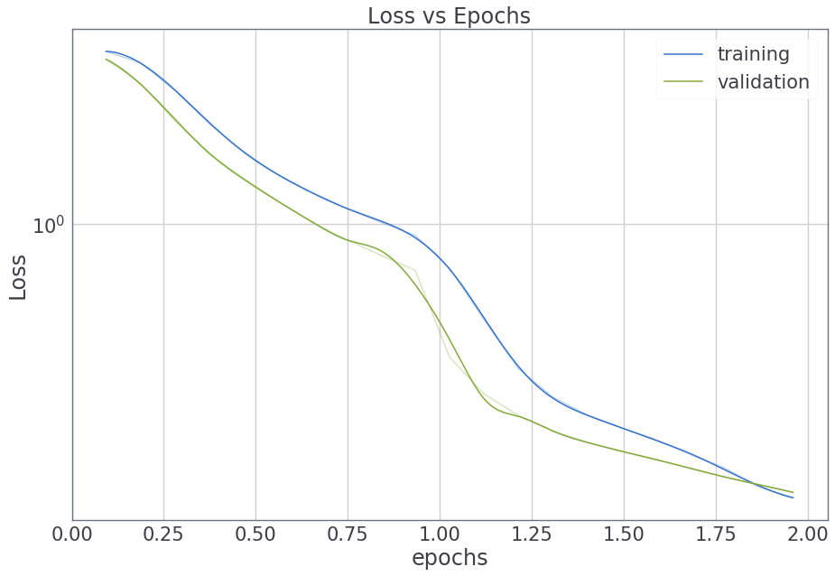

# MagNet: Deep Learning Projects that Build Themselves

<div align="center">
  
</div>

<br>

[](https://github.com/svaisakh/magnet/blob/master/LICENSE)
[](https://travis-ci.org/MagNet-DL/magnet)
[](https://magnet-dl.readthedocs.io/en/latest/?badge=latest)

[](https://github.com/svaisakh/magnet/releases)

[](https://gitter.im/MagNet-DL/Lobby/?utm_source=badge&utm_medium=badge&utm_campaign=pr-badge&utm_content=badge)
[](https://github.com/svaisakh/magnet/pulls)
[](https://codecov.io/gh/MagNet-DL/magnet)
[](https://www.codacy.com/app/svaisakh/magnet?utm_source=github.com&amp;utm_medium=referral&amp;utm_content=MagNet-DL/magnet&amp;utm_campaign=Badge_Grade)
[](https://www.openhub.net/p/magnet)

MagNet is a high-level Deep Learning API, wrapped around PyTorch.

It was developed with the aim of reducing boilerplate code and writing Deep Learning architectures with more grace.

You should take a look at it if you need something that is:

- **Intelligent.** MagNet's ``Node``s are _self-aware_. Intelligent.
  They attach to each other like magnets (hence the name).
  This enables you to build complex architectures easily.
  
- **Simple.** MagNet's API enables a simplistic workflow.
  Get the data. Define the model. Train. Debug. Test. Deploy.
  
- **Extensible.** Written on top of the awesome PyTorch library,
  MagNet can also mix with lower-level details.
  
- **Ready.** The ``Trainer`` can accommodate **any training logic**, however complex.
  This means that you can do almost any experiment / research with
  all the features that MagNet has to offer.

<hr>

# Getting started: 30 seconds to MagNetize
The core idea of MagNet is the ``Node``.
Nodes are PyTorch modules that can change their properties dynamically based on the computational graph.

This way, they attach to each other... like magnets!

Here, we define a simple 3-layer CNN.
Note that you only need to specify the bare essentials.
No need to specify the strides, paddings, input sizes, or even flatten the output before feeding it to the final layer.

```python
model = nn.Sequential(mn.Conv(32), *mn.Conv() * 2, mn.Linear(10, act=None))

summarize(model, x=torch.randn(1, 1, 28, 28))

"""
+----------+------------+----------------------+
|   Node   |   Shape    | Trainable Parameters |
+----------+------------+----------------------+
|  input   | 1, 28, 28  |          0           |
+----------+------------+----------------------+
|   Conv   | 32, 14, 14 |         320          |
+----------+------------+----------------------+
|   Conv   |  64, 7, 7  |        18,496        |
+----------+------------+----------------------+
|   Conv   | 128, 4, 4  |        73,856        |
+----------+------------+----------------------+
|  Linear  |     10     |        20,490        |
+----------+------------+----------------------+
Total Trainable Parameters: 113,162
"""
```

Now, we'll get the dataset in a ``Data`` container.
``Data`` is a class that abstracts away the different sets (training, validation, test) and provides easy access to loaders.

```python
data = Data.get('mnist')
```

Next, we'll create a ``Trainer``.
MagNet's ``Trainer`` class abstracts away the training process and allows you to add features through ``callbacks``.

You can _implement your own training logic_.
Here, we'll just use the built-in ``SupervisedTrainer``.

```python
trainer = SupervisedTrainer(model)

# Tracks the loss, metrics and adds a nice progress-bar
monitor_callback = callbacks.Monitor()

# Train the model for one epoch
trainer.train(data(batch_size=64, shuffle=True), callbacks=[monitor_callback])
```

See the progress

```python
monitor_callback
```

<div align="center">
  
</div>

For a more thorough introduction, check out:

[Quickstart - Training an AI to Recognize Handwritten Digits](Tutorials/MNIST-Quickstart/MNIST-Quickstart.ipynb)

# Installation

Clone the MagNet repository by running

``git clone https://github.com/svaisakh/magnet.git``

Create the conda environment that has all the needed packages and dependencies.

``
cd magnet && conda env update
``

Add the directory to the ```$PYTHONPATH``` variable by adding the following line to your ```.bashrc```

``export PYTHONPATH=$PYTHONPATH:~/magnet``

Point to a directory to store datasets by default.

``export MAGNET_DATAPATH="<PATH_TO_DIRECTORY>"``

Update by running

``source ~/.bashrc``

Anytime you use MagNet, activate the conda environment

``conda activate magnet``

<hr>

# Nodes - Models that build themselves!

Nodes are PyTorch modules that are _self-aware_!

Nodes can react to what's going on and dynamically change based on the input.

You don't have to worry about specifying the dimensionality of the input,
reshaping or having to work out whether to use Conv1D, Conv2D or Conv3D.

Here's a simple Deep Neural Network with two hidden layers:

```python
dnn = nn.Sequential(mn.Linear(50), mn.Linear(10, act=None))
```

You don't need to specify anything except the bare essentials.

```python
# Intelligent reshaping between nodes
conv = mn.Conv(32)
linear = mn.Linear(10)

x = torch.randn(1, 1, 28, 28)
y = conv(x)
print(y.shape) # Output: torch.Size([1, 32, 14, 14])

z = linear(y)
print(z.shape) # Output: torch.Size([1, 10])

# Din't need to flatten input to Linear layer
```

MagNet's Nodes are built just in time, according to the computational graph.

## Witty Features

Create multiple copies of the node

```python
mn.Linear(10) * 4
```
Create multiple copies with different hidden sizes

```python
mn.Linear() * (50, 30, 10)
mn.Conv() * (50, 30, 10)
```

Built-in activation functions and batch normalization

```python
model = nn.Sequential(mn.Conv(32), mn.Conv(64, act='tanh', bn=True), mn.Conv(128, act='lrelu'),
                      mn.Conv(10, act=None))
```

## Examples

DCGAN:

```python
conv = lambda *args, **kwargs: mn.Conv(*args, k=5, p='same', act='lrelu', **kwargs)

discriminator = nn.Sequential(conv(32), *conv(bn=True) * (64, 128, 256), mn.Linear(act='sigmoid'))

conv = lambda *args, p='same', bn=True, **kwargs: mn.Conv(*args, k=5, p=p, bn=bn, **kwargs)

generator = nn.Sequential(mn.Linear((256, 7, 7)), *conv(p='double') * 2, conv(32),
                          conv(1, bn=False, act='tanh'))
```

State of the art, 34-layer ResNet:

```python
class ResBlock(mn.Node):
    def __init__(self, c=None, p='same'):
        super().__init__(c)
    
    def build(self, x):
        # Tell the ResBlock how it should build itself   
        c = self._args['c']
        p = 'half' if c is None and self._args['p'] != 'same' else 'same'
        self.convs = nn.Sequential(mn.Conv(c, p=p), mn.Conv(c, p='same', act=None))
        
        super().build(x)
        
    def forward(self, x):
        res = self.convs(x)
        # If downsampling, pad using zeros
        if x.shape[-1] != res.shape[-1]:
            x = F.avg_pool2d(x, 2, 2, x.shape[2] % 2)
            x = torch.cat([x, torch.zeros(x.shape[0], res.shape[1] - x.shape[1],
                                          x.shape[2], x.shape[3])], dim=1)
        
        return F.relu(res + x)
        
res_layer = lambda n, c=None: nn.Sequential(ResBlock(c, p='half'),
                                            *[ResBlock(c) for _ in range(n - 1)])

resnet34 = nn.Sequential(mn.Conv(64, k=7), nn.MaxPool2d(3, 2, 1), 
                         res_layer(3, 64), res_layer(4), res_layer(6), res_layer(3),
                         nn.AvgPool2d(7), mn.Linear(1000, act=None)).eval()
```

<hr>

# Painless Training

MagNet's helps you train your models simply, effortlessly.

```python
# Train a classifier
trainer = SupervisedTrainer(model)
trainer.train(data(batch_size=16, shuffle=True))
```

##### Feature Filled Callbacks

Additional bells and whistles can be added using _callbacks_.

```python
# This callback monitors the training and logs the losses and metrics.
# Also displays a nice progress bar
monitor = callbacks.Monitor()

# This callback tracks the metrics on a validation set
validate = callbacks.Validate(data(batch_size=16, mode='val'),
                              SupervisedTrainer.validate)

# This callback saves and loads all models, optimizers, schedulers etc. periodically
checkpoint = callbacks.Checkpoint(save_path)

# This is some goofy callback defined by you. I don't know what it does exactly
i_am_kewl = MyGeniusCallback()

# Train again
trainer.train(data(batch_size=16, shuffle=True),
              callbacks=[validate, monitor, checkpoint, i_am_kewl])
```

You don't need to write training loops, logging or serialization code.

## Bring your own logic

MagNet is a general purpose framework.

Which means you can **use any training logic** and plug it right into the trainer.

```python
class MyTrainer(Trainer):
    def optimize(self):
        # Override this method with my own crazy logic
        generator, discriminator = self.models
        optimizer_generator, optimizer_discriminator = self.optimizers
        
        x = next(self.dataloader)
        z = torch.randn(x.shape[0], 32)
        
        x_fake = generator(z)
        
        p_x = discriminator(x)
        
        loss_x = some_loss_fn(p_x)
        loss_x.backward()
        optimizer_discriminator(loss_x)
        
        p_x_fake = discriminator(x_fake)
        
        # Some wierd stuff here
        # ...
        p_x_delta_2_nice_place = discriminator(generator(x_really_real))
        # ...
        # Some out this world shit here
        # ...
        and_that_is_how_you_invest_in_bitcoin = F.cross_entropy(z_strawberry_hat)
        # ...
        
        return massive_blood_loss
        """
```

And then, you can use the trainer like always in all it's might and glory.

```python
trainer = MyTrainer(models=[generator, discriminator],
                    optimizers=[nn.Adam(generator.parameters()),
                                nn.Adam(discriminator.parameters())])

trainer.train(data(batch_size=64, shuffle=True), epochs=13.8e9, callbacks=callbacks)
```

<hr>

# Debugging Tools

#### Catch breaks in computational graph

```python
# Suppose this is the loss function
def reconstruction_loss(x_gen, y):
  return torch.tensor([F.cross_entropy(input_, target)
                       for input_, target in zip(x_gen, y)]).mean()
    
# The check_flow() method can trace any breaks in gradient flow.
mdb.check_flow(trainer, data)
# Raises RuntimeError with a list of broken parameteres

# Aha! The loss function had created a new Tensor
# which did not have the gradient history
def reconstruction_loss(x_gen, y):
  return torch.stack([F.cross_entropy(input_, target)
                      for input_, target in zip(x_gen, y)]).mean()

mdb.check_flow(trainer, data)
# No breaks. No errors. Safe to move on.
```

#### Overfit a small sample

If you can't overfit on a small sample, the model probably cannot model the complexity of the data.

```python
model = mn.Linear(10)
# ...
# The overfit() function trains the model on various sample sizes and batch sizes.
mdb.overfit(trainer, data, batch_size=64)
```

<div align="center">
  
  Failed Overfitting
</div>

```python
# Oops! Looks like there was something wrong.
# Loss does not considerable decrease for samples sizes >= 4.
# Of course, the activation was 'relu'.
model = mn.Linear(10, act=None)
# ...
mdb.overfit(trainer, data, batch_size=64)
```
<div align="center">
  
  Good Overfitting
</div>

#### Watch the model evolve

Sometimes, it is helpful to understand exactly how the model evolves over time.

When does the model learn to attend, to decode, to summarize, to track, to colorize?

The ``Babysitter`` callback constantly monitors the model and logs the mean relative gradients for each parameter. This will tell you how the model is learning as training progresses.

```python
# Just add the callback into the mix
trainer.train(dataloader, epochs, callbacks=[*my_existing_callbacks, Babysitter()])
```

<hr>

# Automatic Acceleration

**MagNet's codebase is device-agnostic.**

All data, models, tensors created by MagNet are automatically run on the faster hardware.

No need to shuttle between ``.to(device)`` and ``.cpu()`` calls.

```python
# When run on CPU
import magnet as mag
# Prints: Running your code on a CPU

"""
Your code here
"""
```

```python
# When run on GPU
import magnet as mag
# Prints: Accelerating your code on an NVIDIA 1080Ti GPU.

"""
Same code here
"""
```

<hr>

## Contributors Needed

I'm actively looking for contributors who can help take this forward.

Lots of Node building, Data Loading, Trainer Watching and Bug Squashing to be done.

Join us on Gitter. [](https://gitter.im/MagNet-DL/Lobby/?utm_source=badge&utm_medium=badge&utm_campaign=pr-badge&utm_content=badge)


<div align="center">
  Handcrafted with ❤ by Vaisakh
 </div>

 <br>
 <hr>
 <sub>Created my free logo at LogoMakr.com</sub>

