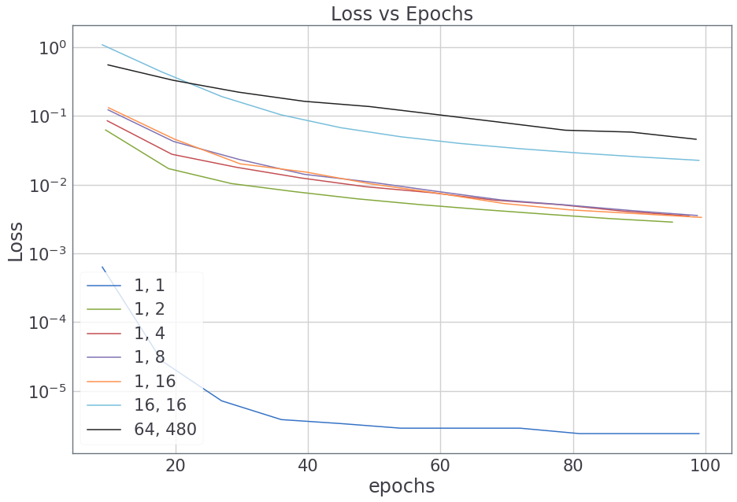

<div align="center">
   
  <h2>Deep Learning Projects that Build Themselves</h2>
  <br>
  
  MNIST in a few lines.
</div>

<hr>
Dear Friend,
<br><br>
Have you ever:

* felt like Deep Learning was a chore?

* found yourself writing too much boilerplate code that didn't matter in the end?

* started building an architecture only to feel overwhelmed?

* built a model only to find that there's some mysterious fault?

* have had to write ominous checkpointing, monitoring and validation code?

If only there was a better way of building Deep Learning projects...

sigh...

<div align="center">
	<b>Introducting MagNet</b>
	<br>
	The newest, coolest framework on the Deep Learning block.
</div>
<br><br>
MagNet makes creating, training, debugging and deploying as simple as pie.

<hr>

# Nodes - Models that build themselves!

Nodes are PyTorch modules that are _self-aware_!

Nodes can react to what's going on and dynamically change based on the input.

Now, you don't have to worry about specifying the dimensionality of the input,
reshaping or having to work out whether to use Conv1D, Conv2D or Conv3D.

MagNet's Nodes do it all for you.

Here's a simple Deep Neural Network with two hidden layers:

```python
dnn = nn.Sequential(mn.Linear(50), mn.Linear(10, act=None))
```

See, you don't need to specify anything except the essentials.

## Making life simpler

Nodes bring some witty features with them such as:

```python
# Create multiple copies of the node
mn.Linear(10) * 4
```

```python
# Create multiple copies with different hidden sizes
mn.Linear() * (50, 30, 10)
mn.Conv() * (50, 30, 10)
```

```python
# Built-in activation functions and batch normalization
model = nn.Sequential(mn.Conv(32), mn.Conv(64, act='tanh'), mn.Conv(128, act='lrelu'),
                      mn.Conv(10, act=None))
```

```python
# Intelligent reshaping between nodes
conv = mn.Conv(32)
linear = mn.Linear(10)

x = torch.randn(1, 1, 28, 28)
y = conv(x)
print(y.shape) # Output: torch.Size([1, 32, 14, 14])

z = linear(y)
print(z.shape) # Output: torch.Size([1, 10])

# Din't need to flatten input to Linear layer
```

MagNet's Nodes are built just in time, according to the computational graph.

## Create complex architectures easily

Here's the DCGAN:
```python
conv = lambda *args, **kwargs: mn.Conv(*args, k=5, p='same', act='lrelu', **kwargs)

discriminator = nn.Sequential(conv(32), *conv(bn=True) * (64, 128, 256), mn.Linear(1, act='sigmoid'))

conv = lambda *args, p='same', bn=True, **kwargs: mn.Conv(*args, k=5, p=p, bn=bn, **kwargs)

generator = nn.Sequential(mn.Linear((256, 7, 7)), *conv(p='double') * 2, conv(32),
                          conv(1, bn=False, act='tanh'))
```

Here's a 34-layer, state of the art ResNet:
```python
class ResBlock(mn.Node):
    def __init__(self, c=None, p='same'):
        super().__init__(c)
    
    def build(self, x):
        # Tell the ResBlock how it should build itself   
        c = self._args['c']
        p = 'half' if c is None and self._args['p'] != 'same' else 'same'
        self.convs = nn.Sequential(mn.Conv(c, p=p), mn.Conv(c, p='same', act=None))
        
        super().build(x)
        
    def forward(self, x):
        res = self.convs(x)
        # If downsampling, pad using zeros
        if x.shape[-1] != res.shape[-1]:
            x = F.avg_pool2d(x, 2, 2, x.shape[2] % 2)
            x = torch.cat([x, torch.zeros(x.shape[0], res.shape[1] - x.shape[1],
                                          x.shape[2], x.shape[3])], dim=1)
        
        return F.relu(res + x)
        
res_layer = lambda n, c=None: nn.Sequential(ResBlock(c, p='half'),
                                            *[ResBlock(c) for _ in range(n - 1)])

resnet34 = nn.Sequential(mn.Conv(64, k=7), nn.MaxPool2d(3, 2, 1), 
                         res_layer(3, 64), res_layer(4), res_layer(6), res_layer(3),
                         nn.AvgPool2d(7), mn.Linear(1000, act=None)).eval()
```

<hr>

# Painless Training

MagNet's helps you train your models simply, effortlessly.

```python
# Train a classifier
trainer = SupervisedTrainer(model)
trainer.train(data(batch_size=16, shuffle=True))
```

##### Feature Filled Callbacks

Additional bells and whistles can be added using _callbacks_.

```python
# This callback monitors the training and logs the losses and metrics.
# Also displays a nice progress bar
monitor = callbacks.Monitor()

# This callback tracks the metrics on a validation set
validate = callbacks.Validate(data(batch_size=16, mode='val'),
                              SupervisedTrainer.validate)

# This callback saves and loads all models, optimizers, schedulers etc. periodically
checkpoint = callbacks.Checkpoint(save_path)

# This is some goofy callback defined by you. I don't know what it does exactly
i_am_kewl = MyGeniusCallback()

# Train again
trainer.train(data(batch_size=16, shuffle=True),
              callbacks=[validate, monitor, checkpoint, i_am_kewl])
```

Now, you'll never need to write those pesky, fragile training loops again.

No more logging code. No more serialization code.

Let MagNet handle it all for you.

## Bring your own logic

That's not all.

MagNet is a general purpose framework.

Which means you can use any training logic and plug it right in to the trainer.

```python
class MyTrainer(Trainer):
    def optimize(self):
        # Override this method with my own crazy logic
        generator, discriminator = self.models
        optimizer_generator, optimizer_discriminator = self.optimizers
        
        x = next(self.dataloader)
        z = torch.randn(x.shape[0], 32)
        
        x_fake = generator(z)
        
        p_x = discriminator(x)
        
        loss_x = some_loss_fn(p_x)
        loss_x.backward()
        optimizer_discriminator(loss_x)
        
        p_x_fake = discriminator(x_fake)
        
        # Some wierd stuff here
        # ...
        p_x_delta_2_nice_place = discriminator(generator(x_really_real))
        # ...
        # Some out this world shit here
        # ...
        and_that_is_how_you_invest_in_bitcoin = F.cross_entropy(z_strawberry_hat)
        # ...
        
        return massive_blood_loss
        """
```

And then, you can use the trainer like always in all it's might and glory.

```python
trainer = MyTrainer(models=[generator, discriminator],
                    optimizers=[nn.Adam(generator.parameters()),
                                nn.Adam(discriminator.parameters())])

trainer.train(data(batch_size=64, shuffle=True), epochs=13.8e9, callbacks=callbacks)
```

<hr>

# Be Unstuck

We at MagNet know exactly how it can wrench you gut when you catch a Deep Learning bug.

Sometimes you leave the project out of frustration.

Worse, it could take weeks of training before you realize that there's something not really right.

Worry not! MagNet's debugging tools are here to help.

#### Check if the model is broken

```python
# Suppose this is the loss function
def reconstruction_loss(x_gen, y):
	return torch.tensor([F.cross_entropy(input_, target) 													for input_, target in zip(x_gen, y)]).mean()
    
# The check_flow() method can trace any breaks in gradient flow.
mdb.check_flow(trainer, data)
# Raises RuntimeError with a list of broken parameteres

# Aha! The loss function had created a new Tensor
# which did not have the gradient history
def reconstruction_loss(x_gen, y):
	return torch.stack([F.cross_entropy(input_, target)
                        for input_, target in zip(x_gen, y)]).mean()

mdb.check_flow(trainer, data)
# No breaks. No errors. Safe to move on.
```

#### Follow the shapes

Sometimes you have a hard time building the architecture itself.

The shapes don't fit.

```python
# The shape() context manager traces all tensor
# shapes after every line in the forward function
with mdb.shape(debug=['x', 'out', 'h']):
    model(x)
```

#### Overfit a small sample

If you can't overfit on a small sample, you're screwed.

```python
model = mn.Linear(10)
# ...
# The overfit() function trains the model on various sample sizes and batch sizes.
mdb.overfit(trainer, data, batch_size=64)
```

<div align="center">
  

  Failed Overfitting
</div>

```python
# Oops! Looks like there was something wrong.
# Loss does not considerable decrease for samples sizes >= 4.
# Of course, the activation was 'relu'.
model = mn.Linear(10, act=None)
# ...
mdb.overfit(trainer, data, batch_size=64)
```
<div align="center">
  

  Good Overfitting
</div>

#### Babysit the Model

Over time, you begin to wonder, how do these models learn?

When does the model learn to attend, to decode, to summarize, to track, to colorize.

The ``Babysitter`` callback constantly monitors the ~~baby~~ model and logs the mean relative gradients for each parameter. This will tell you how the model is learning as training progresses.

> Note to self: Rename callback to _Arkangel_

```python
# Just add the callback into the mix
trainer.train(dataloader, epochs, callbacks=[*my_existing_callbacks, Babysitter()])
```

<hr>

# Automatic Acceleration

MagNet does not believe in making you suffer.

You don't need to deal with the CPU if you have a GPU.

Of course, you want the code to run on the _faster, better, shinier_ silicon.

Who wouldn't?

**MagNet's codebase is device-agnostic.**

All data, models, tensors created by MagNet are automatically run on the faster hardware.

Say goodbye to shuttling between ``.to(device)`` and ``.cpu()`` casts.

```python
# When run on CPU
import magnet as mag
# Prints: Running your code on a boring CPU

"""
Your code here
"""
```

```python
# When run on GPU
import magnet as mag
# Prints: Accelerating your code on a shiney new NVIDIA 1080Ti.

"""
Same code here
"""
```

<hr>

# Getting Your Hands on a Copy of MagNet

Clone the MagNet repository by running

``git clone https://github.com/svaisakh/magnet.git``

Checkout the ``develop`` branch.

```
cd magnet
git checkout develop
```

Create the conda environment that has all the needed packages and dependencies.

```conda env update```

Add the directory to the ```$PYTHONPATH``` variable by adding the following line to your ```.bashrc``` (Ubuntu) / ```.bash_profile``` (macOS)

```export PYTHONPATH=$PYTHONPATH:~/magnet```

Point to a directory to store datasets by default.

``export MAGNET_DATAPATH="<PATH_TO_DIRECTORY>"``

Update by running

```source ~/.bashrc``` or ```source ~/.bash_profile``` as appropriate.

Before you want to use MagNet, activate the conda environment

``conda activate magnet``

Read the documentation at http://magnet-dl.readthedocs.io/

**Hurry! Clone Now**

<hr>

# How You Can Help

I'm actively looking for contributors who can help propel this forward.

Lots of Node building, Data loading, Trainer watching and Bug squashing to be done.

A world of magic awaits anyone who dare enter.